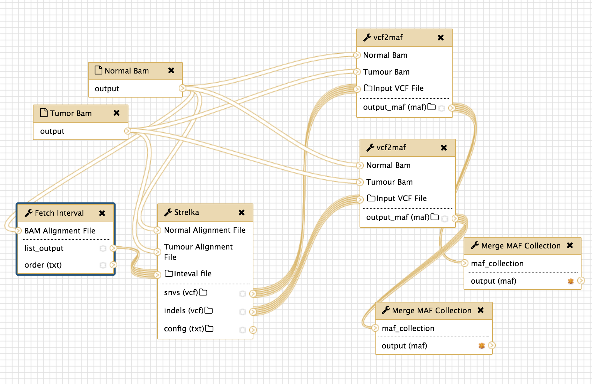
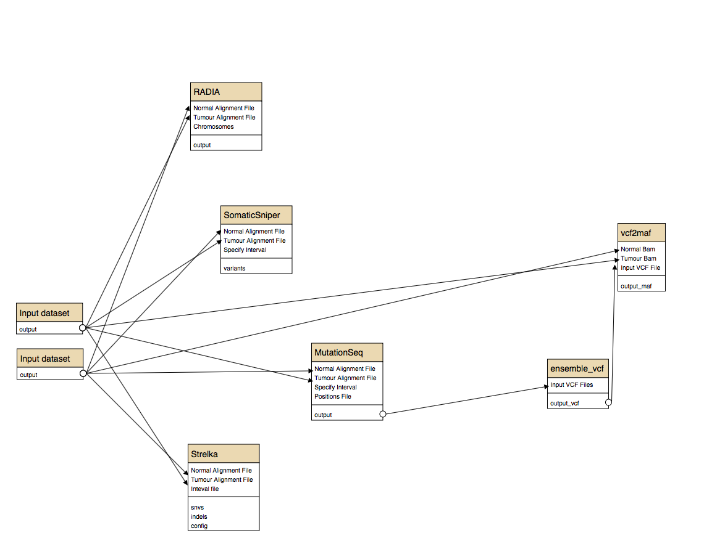
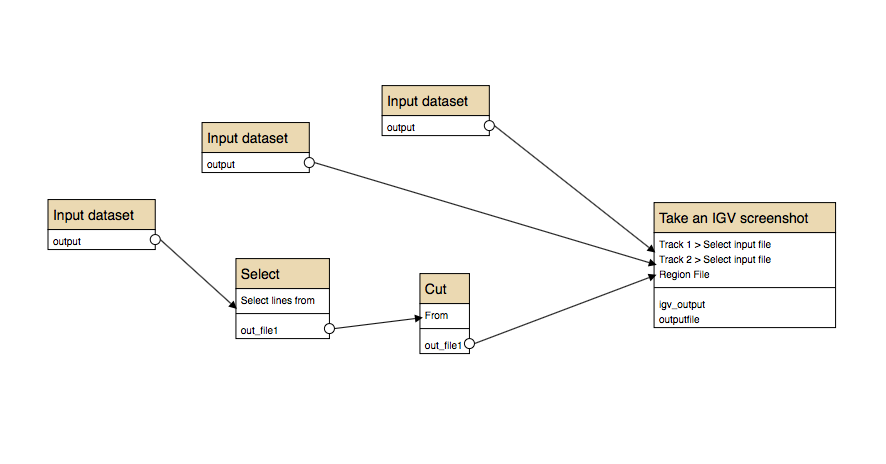
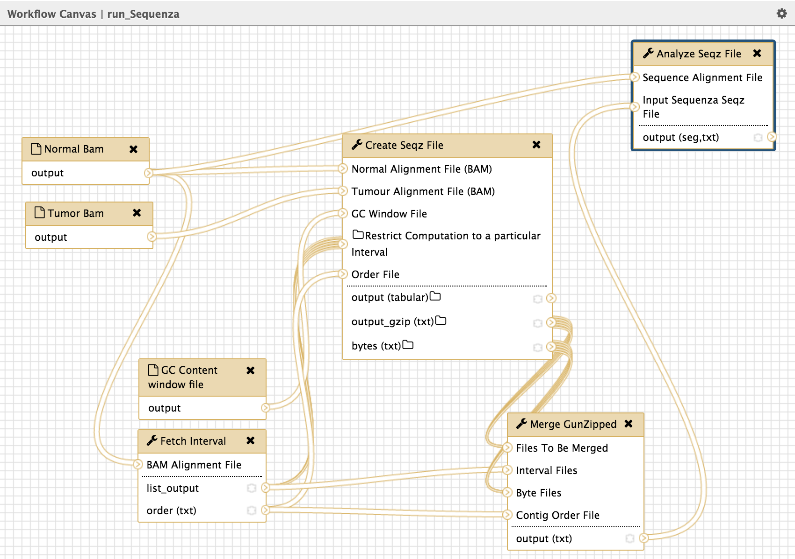
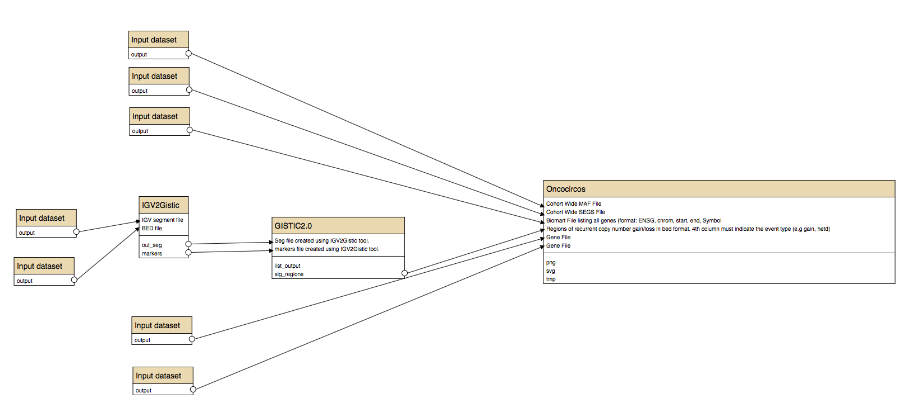
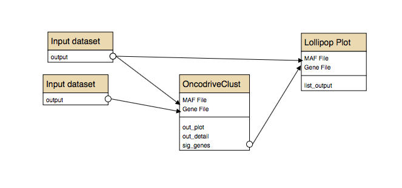

# Cancer Genomics Workflows

These are some example workflows that will get you started using the Cancer Genomics Toolkit
For details, the full toolkit is described [here](http://biorxiv.org/content/early/2016/11/26/089631)
Currently, the workflow export files (\*.ga) in this repository point to an unstable local toolshed and may not work out of the box. We are actively working to correct this issue. We hope to include versions of these workflows via our [Docker](../docker/Dockerfile) release in the near future. In the meantime, the details below should help users construct similar workflows that meet their needs.

###Calling somatic SNVs and indels using Strelka

This [workflow](Galaxy-Workflow-run_Strelka.ga) shows how intervals can be used to parallelize tasks for computationally intensive analyses such as SNV and indel detection. 

###Calling somatic SNVs using an ensemble approach

This [workflow](Galaxy-Workflow-Ensemble_Variant_Caller.ga) demonstrates our implementation of a simple voting-based ensemble variant calling approach using Galaxy. Here, four somatic SNV callers are run on the same tumour/normal pair (RADIA, SomaticSniper, MutationSeq and Strelka). The vcf-formatted output of each tool is passed to ensemble_vcf, which in turn outputs variants detected by a user-specified proportion of these callers (e.g. >50%). The last step in this workflow is to annotate the remaining variants using vcf2maf. The output is a file in the TCGA MAF format that contains detailed annotations of the effect of each variant on canonical gene annotations (from Ensembl).

---

###Taking a batch of screenshots in IGV for variants affecting specific loci

It is sometimes important to visually check the quality of somatic SNV and indel calls. This simple [workflow](Galaxy-Workflow-IGVScreenshotVariants.ga) uses an extended implementation of the igv_screenshot tool to capture screenshots of the aligned reads (in IGV) for a set of variants specified from a MAF file. The workflow first selects lines matching a user-specified set of criteria (e.g. *Missense|Nonsense*) using the Select tool. The other required inputs are the tumor and normal bam file from the patient being analyzed. This workflow generates a data collection containing a PNG file for each line in the input that matches the user's criteria.

---
###Performing Copy Number Analysis in parallel using Sequenza

This [workflow](Galaxy-Workflow-run_Sequenza.ga) shows how intervals can be used to parallelize tasks for computationally intensive analyses (e.g. early steps in the Sequenza process).

---

###Using OncodriveFM to detect significantly mutated genes and visualizations

Assuming one has variant calls from a sufficiently large cohort, a likely goal is to identify significantly/recurrently mutated genes. [OncodriveFM](https://testtoolshed.g2.bx.psu.edu/view/morinlab/oncodrivefm/97e99acadbaf) is one algorithm suitable for this application. This [workflow](Galaxy-Workflow-SignificantGeneDiscovery.ga) takes a merged MAF file containing variants from all patients in a cohort and converts this to the input format (using [maf2tdm](https://testtoolshed.g2.bx.psu.edu/view/morinlab/package_maf2tdm_1_0/fd09386ad95f)) required by OncodriveFM. All genes passing a user-specified Q-value cutoff will have lollipop plots automatically generated. The full OncodriveFM result is separately passed to OncoprintPlus for cohort-wide gene-by-patient visualization.

---
###Reformating and Merging CNV results from a cohort

This shows an example of using data collections to perform the same analysis on a batch of files. In this case, the workflow accepts a collection of output files from either Sequenza or Titan, reformats them for GISTIC or Oncocircos, then concatenates them into one file.

---

###Running GISTIC on CNV results and generating Oncocircos visualization

Copy number information can be determined from whole genome and whole exome data using workflows such as Sequenza and Titan. This workflow uses the GISTIC algorithm to determine regions of the genome commonly affected by copy number gain and loss within a sufficiently large patient cohort. Inputs for [GISTIC](https://testtoolshed.g2.bx.psu.edu/view/morinlab/gistic/d16928a77255) must first be reformatted from a standard (IGV-friendly) *seg* format using the [igv2gistic](https://testtoolshed.g2.bx.psu.edu/view/morinlab/igv2gistic/e4da94676cf8) tool. This also requires an annotation of the exonic regions in BED format ([for Agilent SureSelect and hg19, use this](./agilent_sureselect_all_exons_v5_and_utr.sort.merge.hg19.bed.gz)). This workflow separately accepts the *seg* file in a slighly different format needed by oncocircos and a gene annotation from Ensembl BioMart ([for hg19, use this](./hg19_genes_biomart.txt)). Together, the raw copy number, mutations and GISTIC outputs are used to produce an overview image using [oncocircos](https://testtoolshed.g2.bx.psu.edu/view/morinlab/oncocircos/417f984cd2e2). 

---

###Running OncodriveClust and Visualizing Mutations in Lollipop Plots

Another method to detect mutation recurrence involves searching for mutation clusters and hotspots. OncodriveClust is used in this [workflow](Galaxy-Workflow-MutClusterDiscovery.ga) to accomplish this. This simple workflow uses the *maftools* implementation of OncodriveClust to detect significantly mutated genes and return the detailed output as a plain text file. Lollipop plots are produced for all genes that are above a user-specified Q-value cutoff.
